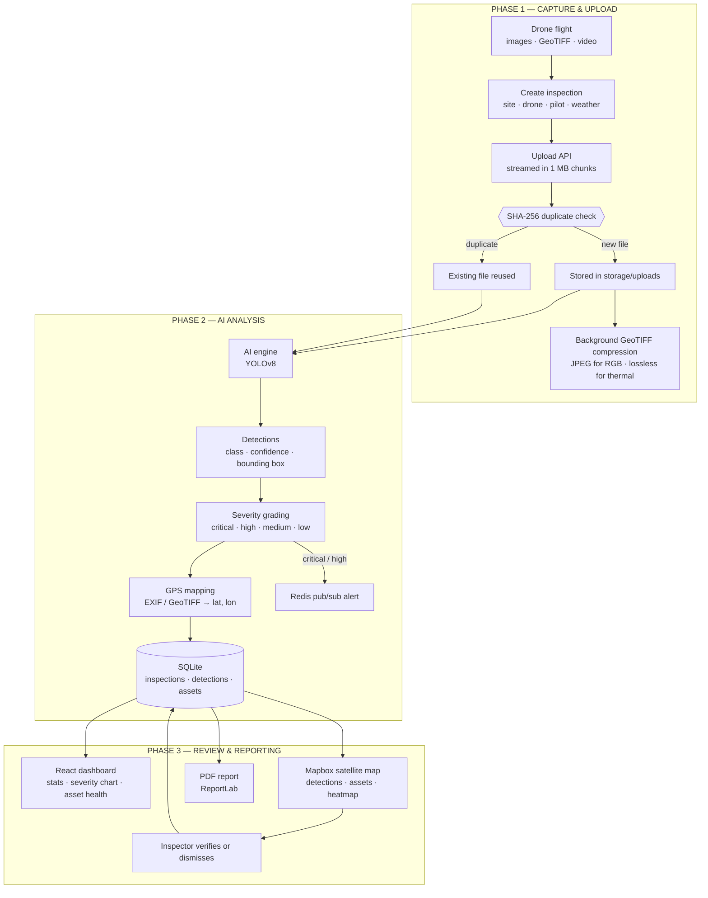
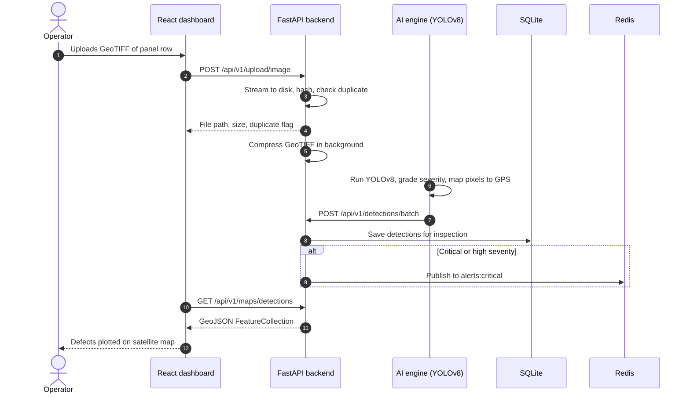

# AeroInspect AI — Drone Inspection Platform for Solar Farms & Industrial Infrastructure

An end-to-end platform that turns **drone footage into actionable maintenance data**. Operators upload aerial images, GeoTIFF orthomosaics or video; a **YOLOv8** model finds defects such as cracks, hotspots, soiling and corrosion; every detection is geo-tagged, stored and plotted on a satellite map; and the platform produces a **PDF inspection report** with severity breakdowns and recommendations.

`Python` `FastAPI` `YOLOv8 (Ultralytics)` `SQLite` `SQLAlchemy (async)` `Redis` `React` `Mapbox` `ReportLab` `rasterio` `Docker` `Nginx`

> **Project status:** active development. The detection pipeline runs on the base YOLOv8 weights until a custom model is trained on labelled drone data (see [Training a Custom Model](#training-a-custom-model)).


---

## Table of Contents

- [The Problem](#the-problem)
- [The Solution](#the-solution)
- [System Architecture](#system-architecture)
- [Workflow Diagram](#workflow-diagram)
- [One Detection, End to End](#one-detection-end-to-end)
- [AI Model & Defect Classes](#ai-model--defect-classes)
- [Storage Optimisation](#storage-optimisation)
- [Key Features](#key-features)
- [Tech Stack](#tech-stack)
- [File Structure](#file-structure)
- [Installation & Setup](#installation--setup)
- [How to Run](#how-to-run)
- [Training a Custom Model](#training-a-custom-model)
- [API Reference](#api-reference)
- [Roadmap](#roadmap)

---

## The Problem

- Solar farms contain **tens of thousands of panels** spread over large areas. Manual walk-through inspection is slow, expensive and exposes technicians to heat and electrical hazards.
- Defects such as **hotspots, micro-cracks and delamination** reduce energy output and can become fire risks, but are easy to miss by eye.
- Drones capture the data quickly, but a single flight produces **gigabytes of imagery** that someone still has to review frame by frame.
- Findings are often kept in spreadsheets or photos without precise locations, so maintenance teams **cannot easily find the faulty panel** on site.

## The Solution

| Principle | How AeroInspect AI implements it |
|---|---|
| Automate the review | YOLOv8 scans every image and video frame and flags defects with a confidence score |
| Every defect has a location | GPS is extracted from EXIF or GeoTIFF metadata and each detection is mapped to latitude / longitude |
| Prioritise what matters | Detections are graded **critical / high / medium / low**, and critical or high findings trigger real-time alerts |
| See the whole site at once | Detections and assets are served as GeoJSON and plotted on a Mapbox satellite map with a severity-weighted heatmap |
| Hand-off ready output | One click generates a PDF report with statistics, severity tables and recommendations |
| Easy to run anywhere | SQLite needs zero setup; the full stack starts with one Docker Compose command |

---

## System Architecture

AeroInspect AI is organised into three phases:

**Phase 1 — Capture & upload.** The operator creates an inspection (site, drone model, pilot, weather) and uploads images (JPG, PNG, GeoTIFF) or video (MP4, MOV, AVI, MKV). Uploads are streamed to disk in chunks, de-duplicated by SHA-256 hash, and large GeoTIFFs are compressed automatically in the background.

**Phase 2 — AI analysis.** The AI engine runs YOLOv8 on each image or sampled video frame, assigns a severity to each detection, and converts pixel positions to GPS coordinates. Detections are posted to the backend in batches and linked to the inspection and asset. Critical and high-severity findings are published to Redis for live alerts.

**Phase 3 — Review & reporting.** The React dashboard shows site statistics, severity distribution and asset health. The map view renders detections, assets and a severity-weighted heatmap. Inspectors verify or dismiss detections, and a PDF report is generated for the maintenance team.

### Core Components

| Component | Module | Role |
|---|---|---|
| REST API | `backend/src/main.py`, `api/router.py` | FastAPI app, versioned under `/api/v1`, serves uploads and reports as static files |
| Authentication | `api/v1/endpoints/auth.py`, `core/security.py` | Register, login and JWT-protected endpoints |
| Inspections | `api/v1/endpoints/inspections.py` | Create, list, filter, update and delete inspections with defect statistics |
| Uploads | `api/v1/endpoints/upload.py`, `services/media_service.py` | Streaming upload, hash de-duplication, background GeoTIFF compression |
| Detections | `api/v1/endpoints/detections.py` | Batch ingest from the AI engine; filter by severity, class, status |
| Assets | `api/v1/endpoints/assets.py` | Panels, inverters and structures with health score and maintenance dates |
| Maps | `api/v1/endpoints/maps.py` | GeoJSON for detections and assets, heatmap points weighted by severity |
| Dashboard | `api/v1/endpoints/dashboard.py` | Site-wide statistics, severity distribution, average asset health |
| Reports | `api/v1/endpoints/reports.py` | Report records, background generation, PDF download |
| Notifications | `services/notification_service.py` | Redis pub/sub channel for critical and high-severity alerts |
| Cloud storage (optional) | `services/storage_service.py` | S3 upload and presigned URLs when AWS credentials are configured |
| AI engine | `ai-engine/src/` | YOLOv8 inference, GPS extraction, severity grading, PDF generation |
| Model training | `ai-engine/training/train_yolo.py` | Fine-tunes YOLOv8n on the 13 inspection classes and exports ONNX |
| Dashboard UI | `frontend/` | React dashboard with Mapbox satellite maps |

---

## Workflow Diagram



## One Detection, End to End



---

## AI Model & Defect Classes

| Item | Detail |
|---|---|
| Base model | **YOLOv8n** (Ultralytics), chosen for fast inference on CPU |
| Custom model | Fine-tuned on drone imagery with 13 classes, 640 px input, early stopping (patience 20) |
| Export | PyTorch `.pt` for inference, ONNX (dynamic shapes) for portable deployment |
| Hardware | CPU by default; uses the GPU automatically during training when one is available |

The custom model detects 13 classes across three categories:

| Category | Classes |
|---|---|
| Solar panel defects | `crack`, `hotspot`, `soiling`, `delamination`, `broken_panel` |
| Site & structural issues | `vegetation_overgrowth`, `structural_damage`, `corrosion`, `missing_component`, `water_damage` |
| Safety monitoring | `worker`, `vehicle`, `safety_violation` |

Each detection is stored with its class, confidence, bounding box, centre point, GPS position and altitude, links to the original and annotated images, the video frame and timestamp (for video), and a review status (`open`, verified by, notes).

**Severity weighting on the map heatmap:** critical 1.0 · high 0.7 · medium 0.4 · low 0.2.

---

## Storage Optimisation

Drone data is large: a single GeoTIFF orthomosaic can exceed 1.5 GB. The upload pipeline keeps storage under control automatically.

| Technique | Effect |
|---|---|
| Chunked streaming | Uploads are written in 1 MB chunks, so multi-GB files never load fully into memory |
| Content-hash filenames | Uploading the same file twice stores it only once; the API returns `"duplicate": true` |
| GeoTIFF compression | 8-bit RGB → tiled JPEG (typically 10–20× smaller); thermal and multispectral → lossless DEFLATE, preserving exact values |
| Safe replacement | The original is replaced only after the compressed copy is verified |
| Upload limits | Configurable maximum size per image and per video |

Existing files can be compressed with `python scripts/compress_existing_tiffs.py storage/uploads`.

---

## Key Features

- **YOLOv8 defect detection** across 13 solar, structural and safety classes, with confidence scores.
- **GPS extraction** from EXIF and GeoTIFF metadata, with pixel-to-coordinate mapping for each detection.
- **Geospatial API** returning GeoJSON for detections and assets, bounding-box filtering and a severity-weighted heatmap.
- **Severity grading and live alerts** — critical and high findings are published over Redis.
- **Asset health tracking** — health score, status, capacity (kW), last inspection and next maintenance date per asset.
- **Inspector review loop** — detections can be verified, dismissed and annotated.
- **Dashboard** — total inspections and defects, monthly activity, severity distribution and average asset health.
- **PDF reports** with statistics, severity tables and recommendations.
- **Efficient storage** — streaming uploads, duplicate detection and automatic GeoTIFF compression.
- **JWT authentication** on all data endpoints.
- **Zero-config database** — SQLite, created automatically on first start.
- **Optional S3 storage** when AWS credentials are provided.

## Tech Stack

| Layer | Technology |
|---|---|
| Language | Python 3.11, JavaScript |
| API | FastAPI, Pydantic v2, Uvicorn |
| Database | SQLite via SQLAlchemy 2 (async) + aiosqlite; Alembic for migrations |
| AI / computer vision | Ultralytics YOLOv8, ONNX export |
| Geospatial | rasterio, Shapely, pyproj, Pillow (EXIF) |
| Messaging & cache | Redis (pub/sub alerts) |
| Reports | ReportLab (PDF) |
| Auth | python-jose (JWT), passlib + bcrypt |
| Frontend | React, Mapbox GL |
| Infrastructure | Docker, Docker Compose, Nginx |
| Cloud (optional) | AWS S3 via boto3 |

## File Structure

```
aeroinspect-ai/
│
├── docker-compose.yml            # redis, ai-engine, backend, frontend, nginx
├── .env.example                  # environment template (copy to .env)
├── Makefile                      # init, build, up, migrate shortcuts
├── README.md
│
├── backend/
│   ├── Dockerfile
│   ├── requirements.txt
│   ├── alembic.ini
│   ├── alembic/                  # migration environment
│   ├── data/                     # SQLite database (git-ignored)
│   └── src/
│       ├── main.py               # FastAPI app, CORS, static files, startup
│       ├── config.py             # settings (env-driven)
│       ├── database.py           # async engine, session, table creation
│       ├── api/
│       │   ├── router.py         # mounts all v1 routers
│       │   └── v1/endpoints/     # auth, inspections, upload, detections,
│       │                         # assets, maps, dashboard, reports
│       ├── models/               # user, inspection, detection, asset, report
│       ├── schemas/              # Pydantic request/response models
│       ├── services/             # media, storage (S3), notifications, inspections
│       └── core/                 # security, exceptions
│
├── ai-engine/
│   ├── Dockerfile
│   ├── requirements.txt
│   ├── src/                      # inference service (port 8001)
│   ├── models/                   # YOLO weights (git-ignored)
│   └── training/
│       └── train_yolo.py         # custom YOLOv8 training + ONNX export
│
├── frontend/                     # React dashboard (served on port 3000)
├── nginx/
│   └── nginx.conf
├── scripts/
│   └── compress_existing_tiffs.py
│
└── storage/                      # uploads, processed frames, reports (git-ignored)
    ├── uploads/
    ├── processed/
    └── reports/
```

---

## Installation & Setup

**Requirements:** Windows 10/11, macOS or Linux; Docker Desktop; Python 3.10+; Node.js 18+ (for local frontend development); about 8 GB RAM. A free [Mapbox](https://www.mapbox.com) account is needed for the satellite map.

### Step 1 — Clone the repository
```bash
git clone https://github.com/AnjaliYadav-04/aeroinspect-ai.git
cd aeroinspect-ai
```

### Step 2 — Configure the environment
```bash
copy .env.example .env        # Windows
cp .env.example .env          # macOS / Linux
```

Then fill in:

| Variable | Description |
|---|---|
| `SECRET_KEY` | Random string for signing JWTs. Generate with `python -c "import secrets; print(secrets.token_hex(32))"` |
| `MAPBOX_TOKEN` | Your Mapbox public token (starts with `pk.`) |

Optional backend settings (with defaults) include `MAX_IMAGE_UPLOAD_MB` (5000), `MAX_VIDEO_UPLOAD_MB` (5000), `COMPRESS_TIFF_ON_UPLOAD` (true), `TIFF_LOSSY_RGB` (true), `TIFF_JPEG_QUALITY` (90), and `AWS_ACCESS_KEY_ID`, `AWS_SECRET_ACCESS_KEY`, `S3_BUCKET`, `AWS_REGION` for S3.

### Step 3 — Add model weights
Place trained weights in `ai-engine/models/`. To start without a custom model, the base `yolov8n.pt` weights are downloaded automatically by Ultralytics (these detect generic objects only, not solar defects).

## How to Run

### Option 1 — Docker (recommended)
```bash
docker compose up --build
```

| Service | URL |
|---|---|
| Dashboard | http://localhost:3000 |
| API docs (Swagger) | http://localhost:8000/docs |
| API docs (ReDoc) | http://localhost:8000/redoc |
| Health check | http://localhost:8000/health |
| Nginx gateway | http://localhost |

Database tables are created automatically when the backend starts.

### Option 2 — Local development (no Docker)

You need a Redis server running locally (for example `docker run -p 6379:6379 redis:7-alpine`).

```bash
# 1. Backend
python -m venv venv
venv\Scripts\activate                 # Windows  (macOS/Linux: source venv/bin/activate)
pip install -r backend/requirements.txt
cd backend/src
set UPLOAD_DIR=../../storage/uploads  # Windows  (macOS/Linux: export UPLOAD_DIR=...)
set REPORTS_DIR=../../storage/reports
uvicorn main:app --reload --port 8000

# 2. AI engine (new terminal)
cd ai-engine
pip install -r requirements.txt
python src/main.py

# 3. Frontend (new terminal)
cd frontend
npm install
npm run dev
```

### How an Inspection Works
1. Register and log in.
2. Create an inspection with the site name, drone model, pilot and weather conditions.
3. Upload images, GeoTIFFs or video for that inspection.
4. The AI engine detects defects, grades severity and attaches GPS coordinates.
5. Review detections on the map, verify or dismiss them, and check asset health on the dashboard.
6. Generate and download the PDF report.

---

## Training a Custom Model

1. Collect and label drone images in **YOLO format** (one `.txt` label file per image) using a tool such as Roboflow, CVAT or Label Studio, with the 13 classes listed above.
2. Organise the dataset:
   ```
   ai-engine/training/data/
   ├── images/train/   images/val/
   └── labels/train/   labels/val/
   ```
3. Run training inside the AI engine container:
   ```bash
   docker compose exec ai-engine python training/train_yolo.py
   ```
   Training runs for up to 100 epochs at 640 px (batch 16) with early stopping, and exports an ONNX copy.
4. The best weights are saved to `ai-engine/models/drone_custom/weights/best.pt`. Point `MODEL_PATH` in `docker-compose.yml` to this file and restart the AI engine.

---

## API Reference

All endpoints except `/health` and `/auth/register`, `/auth/login` require a JWT (`Authorization: Bearer <token>`). Base path: `/api/v1`.

| Method | Path | Purpose |
|---|---|---|
| POST | `/auth/register` | Create a user account |
| POST | `/auth/login` | Log in and receive a JWT |
| GET | `/auth/me` | Current user profile |
| POST | `/inspections` | Create an inspection |
| GET | `/inspections` | List inspections (filter by status, site; paginated) |
| GET | `/inspections/{inspection_id}` | Inspection details and defect statistics |
| PATCH | `/inspections/{inspection_id}` | Update an inspection |
| DELETE | `/inspections/{inspection_id}` | Delete an inspection and its detections |
| POST | `/upload/image` | Upload JPG, PNG or GeoTIFF (streamed, de-duplicated, compressed) |
| POST | `/upload/video` | Upload MP4, MOV, AVI or MKV |
| POST | `/detections/batch` | Ingest detections from the AI engine |
| GET | `/detections` | List detections (filter by severity, class, status, inspection) |
| GET | `/detections/{detection_id}` | Detection details |
| PATCH | `/detections/{detection_id}` | Verify, dismiss or annotate a detection |
| POST | `/assets` | Register an asset |
| GET | `/assets` | List assets (filter by type, status, inspection) |
| GET | `/assets/{asset_id}` | Asset details and health |
| PATCH | `/assets/{asset_id}` | Update an asset |
| GET | `/maps/detections` | Detections as GeoJSON (filter by inspection, severity, bounding box) |
| GET | `/maps/assets` | Assets as GeoJSON |
| GET | `/maps/clusters` | Severity-weighted points for the heatmap |
| GET | `/dashboard/stats` | Site statistics, severity distribution, asset health |
| POST | `/reports` | Start PDF report generation |
| GET | `/reports` | List reports |
| GET | `/reports/{report_id}` | Report details |
| GET | `/reports/{report_id}/download` | Download the PDF |
| GET | `/health` | Service health (no `/api/v1` prefix) |

---

## Roadmap

1. Label a drone dataset and train the custom 13-class model; publish accuracy metrics (mAP, precision, recall per class).
2. Fix internal authentication so report generation completes reliably.
3. Record uploads in the database and link them to inspections and detections.
4. Server-side defect clustering (DBSCAN) and panel-level asset matching.
5. Thermal (radiometric) image support with temperature-based hotspot severity.
6. Video frame sampling to reduce processing time and storage.
7. Unit and API tests with CI on GitHub Actions.
8. Role-based access (admin, inspector, viewer) and restricted CORS for production.

---

Built by **Anjali Yadav** 
